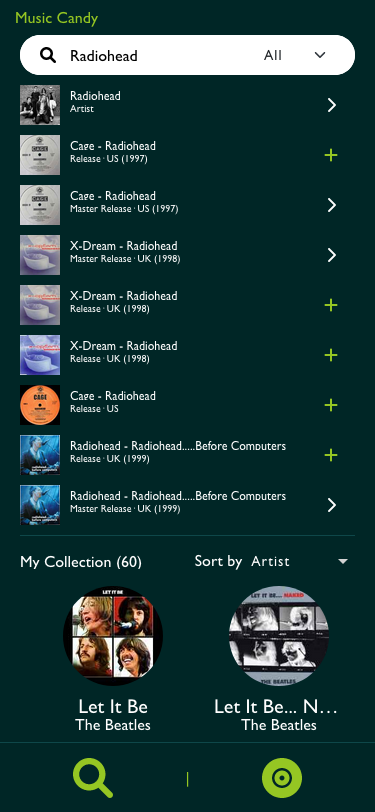

<h1><a href="https://music-candy.netlify.app/" target="_blank">Music Candy</a></h1>

  
  
  
  
  
  
  
  
  

 

💿🎵🎸🎹

 

 

A web app powered by <a href="https://www.discogs.com/">Discogs</a> that allows you to find information about audio recordings from your favorite artists in all formats.

 

## About
Music Candy is a ***fully responsive*** web app that I built with ***create-react-app and redux toolkit***. The app consumes the [Discogs database](https://www.discogs.com/).

### File Structure

Some of the technical highlights implemented in this project:
- Custom Hooks
- Use of advacned hooks, suchs as useRef and useContext
- React Router Dom 6
- Prefectching of Search Query
- Action feeback messages
- Pagination
- React-Bootstrap
- Loading animations
- Modularity

### Features:
- Search for releases by Artist, Album or both
- See Artist page
- Browse through all artist releases
- Add artist releases to own collection from different parts of the app
- See own collection in search page

### Live Demo

- Deployed to Netlify: [Live Demo](https://music-candy.netlify.app/)

### Built With
- HTML, CSS, JavaScript
- React
- React Router Dom 6
- Redux Toolkit
- Axios
- Bootstrap
- React-Bootstrap

### About the API

- Documentation of Discog's API can be accessed [here](https://www.discogs.com/developers/).

## Getting Started

To get a local copy up and running, follow these simple example steps.

### Prerequisites
- A browser to open the main file
- Node.js
- NPM
- Yarn

### Get files
1. Open your terminal or command prompt.
2. If you do not have git installed in your system, skip this step and go to step 3; otherwise, go to the directory where you want to copy the project files and clone it by copying this text into your command prompt/terminal: `git@github.com:StarSheriff2/music-candy.git`.
 Now go to the ***"Install Dependencies"*** section
3. Download the program files by clicking on the green button that says “**Code**” on the upper right side of the project frame.
4. You will see a dropdown menu. Click on “**Download ZIP**.”
5. Go to the directory where you downloaded the **ZIP file** and open it. Extract its contents to any directory you want in your system.

### Install Dependencies
1. Go to the root directory of the project
2. In your command line, while in the root dir, type `npm install`. It will install all necessary dependencies in your project files
3. Now type `yarn start` or `npm run start`. It will load the project in your default browser.  
**Note: _This command will not stop on its own. If you change something in your project files, it will recompile and reload the page in your browser. To exit, hit "ctrl + c"_**

### Discogs API Setup

1. To make this app work in local development you will need to authenticate it follwing OAuth 1.0's authentication procedure. You can find detailed information about this [here](https://www.discogs.com/developers/).

    Once you have your Consumer Key and your Consumer Secret, do the following:
    - Create an **.env** file in your root folder
    - Copy and paste all your keys and personal data into your **.env** file
    - Your .env file should look something like this:
      

## Development

### Bundle project

- `yarn build`
### Testing
To test, run

- `yarn test`

### Linters
To run the linters included in this repository, go to the root directory of your repository and copy/paste the following commands into your terminal:
(**Note:** Make sure you run `npm install` before you do this)
- for ESlint, `npx eslint.`
- for Stylelint, `npx stylelint "**/*.{css,scss}"`

### All Available Scripts

 
In the project directory, you can run:

### `yarn start`

Runs the app in the development mode.\
Open [http://localhost:3000](http://localhost:3000) to view it in the browser.

The page will reload if you make edits.\
You will also see any lint warnings in the console.

### `yarn test`

Launches the test runner in the interactive watch mode.\
See the section about [running tests](https://facebook.github.io/create-react-app/docs/running-tests) for more information.

### `yarn build`

Builds the app for production to the `build` folder.\
It correctly bundles React in production mode and optimizes the build for the best performance.

The build is minified and the filenames include the hashes.\
Your app is ready to be deployed!

See the section about [deployment](https://facebook.github.io/create-react-app/docs/deployment) for more information.

### `yarn eject`

**Note: this is a one-way operation. Once you `eject`, you can’t go back!**

If you aren’t satisfied with the build tool and configuration choices, you can `eject` at any time. This command will remove the single build dependency from your project.

Instead, it will copy all the configuration files and the transitive dependencies (webpack, Babel, ESLint, etc) right into your project so you have full control over them. All of the commands except `eject` will still work, but they will point to the copied scripts so you can tweak them. At this point, you’re on your own.

You don’t have to ever use `eject`. The curated feature set is suitable for small and middle deployments, and you shouldn’t feel obligated to use this feature. However, we understand that this tool wouldn’t be useful if you couldn’t customize it when you are ready for it.

## Author
👤 **Arturo Alvarez**
- Github: [@StarSheriff2](https://github.com/StarSheriff2)
- Twitter: [@ArturoAlvarezV](https://twitter.com/ArturoAlvarezV)
- Linkedin: [Arturo Alvarez](https://www.linkedin.com/in/arturoalvarezv/)

## 🤝 Contributing

Contributions, issues, and feature requests are welcome!

Feel free to check the [issues page](https://github.com/StarSheriff2/music-candy/issues).

## Show your support

Give a ⭐️ if you like this project!

## 📝 License

This project is [MIT](https://github.com/StarSheriff2/music-candy/blob/main/LICENSE) licensed.
